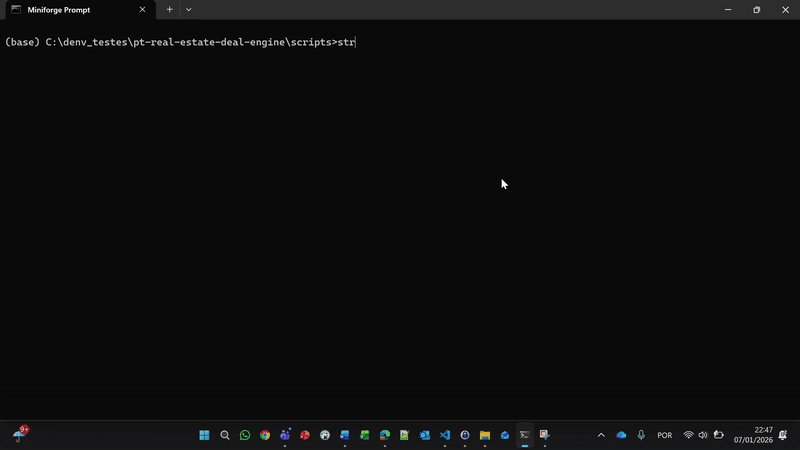
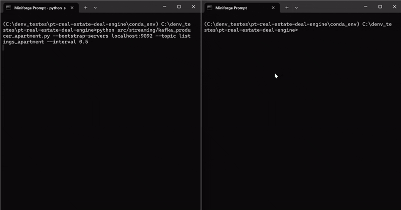

# pt-real-estate-deal-engine


An end-to-end real estate deal detection engine for Portugal, combining historical data, machine learning and streaming-based scoring of new property listings.

Data extracted from https://www.kaggle.com/datasets/luvathoms/portugal-real-estate-2024.
Downloaded data should live in `data/00_raw/`.

This repository is a demo/portfolio showcase: the priority is the end‑to‑end flow rather than squeezing every last percent of model performance. The modeling is intentionally minimal but fit for the use‑case.
Many parts can be improved further; the goal here is to build something that works **end-to-end**. Models were trained for **apartments**, but the same potential and flow apply to the remaining property types.

## Notebooks

EDA order and notes live in `notebooks/README.md` (run EDA notebooks in order, then run the modeling notebooks in order).

## Setup

Install Python dependencies:
```
conda create --prefix C:\denv_testes\pt-real-estate-deal-engine\conda_env --file requirements.txt -y
conda activate C:\denv_testes\pt-real-estate-deal-engine\conda_env
pip install -e .                                                        # custom package installation
```

## Data layout

Paths are centralized in `config/paths.py`:

- `data/00_raw` raw data
- `data/01_clean` cleaned outputs
- `data/02_curated` curated datasets for modeling
- `models` saved models (root)
- `experiments` per-run metrics, params and artifacts

## Streaming scripts

- Kafka producer: `src/streaming/kafka_producer_apartment.py`
- Kafka consumer: `src/streaming/kafka_consumer_apartment.py`

## Running the streaming app (Kafka)

Why local Kafka in this repo:
- This is a demo/portfolio project, so I chose a self-contained setup to keep the whole Kafka flow visible and reproducible within the repo.
- The approach below keeps everything project-local and reproducible without Docker.
- The Kafka binaries are downloaded into `tools/kafka/` (ignored by git), while the scripts show the setup clearly.

### Local Kafka (no admin, no Docker)


1) Download Kafka into the project (one-time):
```
powershell -ExecutionPolicy Bypass -File scripts/download_kafka.ps1
```

2) Start ZooKeeper + Kafka:
```
scripts\start_kafka.bat
```


1) Stop them:
```
scripts\stop_kafka.bat
```

Notes:
- Kafka binaries are not committed; only scripts are.
- The scripts expect Java available via the local `conda_env` using `conda run`.
- On Windows, the scripts use `subst` to shorten the Kafka path and avoid command-length issues.
- To verify the broker is listening on 9092:
```
netstat -ano | findstr :9092
```

Prereqs:
- Kafka broker running (example: `localhost:9092`)
- Models available in `models/` (run the modeling notebook first)

Open two terminals (one per process):

Producer:
```
python src/streaming/kafka_producer_apartment.py --bootstrap-servers localhost:9092 --topic listings_apartment --interval 0.5
```

Consumer:
```
python src\streaming\kafka_consumer_apartment.py --bootstrap-servers localhost:9092 --topic listings_apartment --min-discount 0.15
```


Final Result:


Notes:
- Start order does not matter. If the consumer starts first, it waits for new messages.
- If the producer starts first, the consumer will only read new messages (auto_offset_reset=latest).
- Use multiple consumer terminals with different `--group-id` to simulate multiple active clients.

### Docker

If you have Docker available, this is a quick alternative to the local Kafka setup above (useful if you prefer containers over the repo-local scripts).
```
docker compose up -d
```
